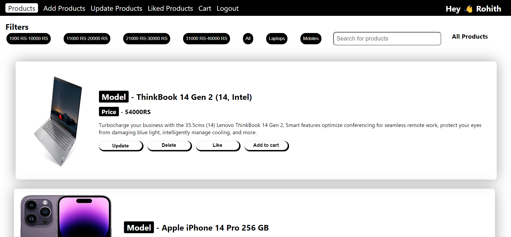

# E-Commerce Website 

## Table of Contents

1. [Introduction](#introduction)
2. [Features](#features)
3. [Technologies Used](#technologies-used)
4. - [Live-Link](#Live-link)
5. [Stay-in-Touch](#Stay-in-Touch)

## Introduction

Welcome to our E-Commerce website built using the MERN stack! This is a full-stack web application that allows users to browse, search products online. The website provides an intuitive and user-friendly interface for customers to explore a wide range of products.

## Features

Certainly! Here are the features with bullet points and dashes, including the description dash:

- User Authentication:
  - Allow users to create accounts
  - Implement a secure login system
  - Enable users to manage their profiles

- Product Catalog:
  - Display a variety of products
  - Provide detailed descriptions for each product
  - Include images for better visualization

- Password Hashing:
  - Implemented bcrypt password hashing for enhanced security

- Filters:
  - Allow filtering of products by categories
  - Provide filters for different price ranges

- Shopping Cart:
  - Enable users to add items to their cart
  - Allow users to remove items from their cart before checkout

- Admin Dashboard:
  - Provide administrators with tools to manage products
  - Offer tools to manage orders
  - Include tools for user management

- Search Functionality:
  - Implement a search feature to help users find specific products easily

- Responsive Design:
  - Ensure the website is mobile-friendly
  - Optimize the website to work well on various devices

## Technologies Used

- MongoDB: A NoSQL database for storing product and user data.
- Express.js: A web application framework for Node.js to build the backend.
- React: A frontend JavaScript library for building user interfaces.
- Node.js: A JavaScript runtime for executing server-side code.
- Redux: A predictable state container for managing application state.

  ## Live-link

[Live-Link](https://e-commerce-rohith.netlify.app/)

## Stay-in-Touch

Connect with me on social media:

